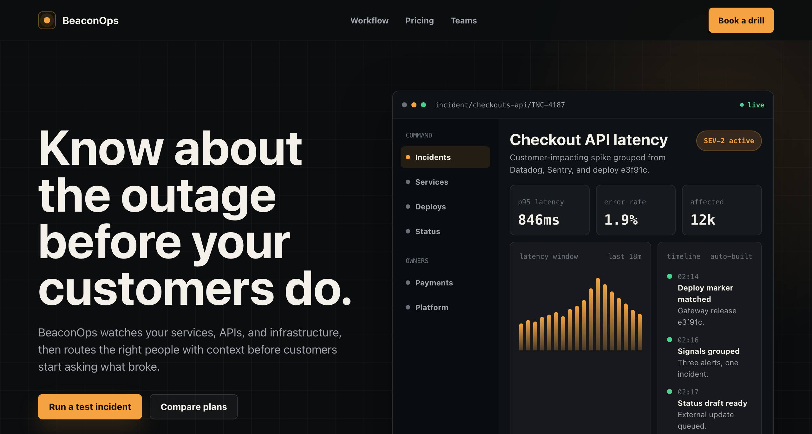
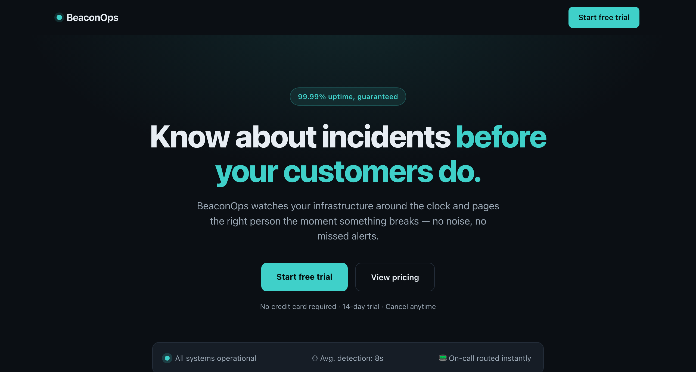

<div align="center">

# Humanize-UI

Give your coding agent some design taste. </br>
Humanize your UI with proven components.

*[Winglet](https://agentwinglet.com) cut 43% of my token usage while building humanize-ui.*

</div>

**With `humanize-ui`**


**Without `humanize-ui`**


For full page and prompts:

- [BeaconOps, fictional incident monitoring software](examples/beaconops)

## How it works

- Inspect the existing frontend before scouting components.
- Search curated UI sources such as Beautiful UI, beUI, Rare UI,
  Transitions.dev, and shadcn/ui.
- Evaluate fit, dependencies, accessibility, responsiveness, and
  maintainability.
- Adapt component code to the product's design language.
- Avoid Frankenstein UI made from mismatched libraries.

## Install

**Via [skills.sh](https://www.skills.sh) (recommended):**  detects your agent and
links the skill in automatically:

```bash
npx skills add umitkaanusta/humanize-ui
```

**Via GitHub** clone it, then copy `SKILL.md` into your agent's
skill directory

```bash
git clone https://github.com/umitkaanusta/humanize-ui.git
mkdir -p .claude/skills/humanize-ui
cp humanize-ui/SKILL.md .claude/skills/humanize-ui/
```

The example shows `.claude`. Use `.cursor` for Cursor, and `.agents` for Codex
and other tools.

## How to use

Just ask your coding agent to use the `humanize-ui` skill on the
overall UI or for a specific screen, component, or interaction.

Like so:

```text
Use humanize-ui on the pricing page. Keep the current brand direction, avoid
mismatched libraries, and verify desktop and mobile layouts.
```
