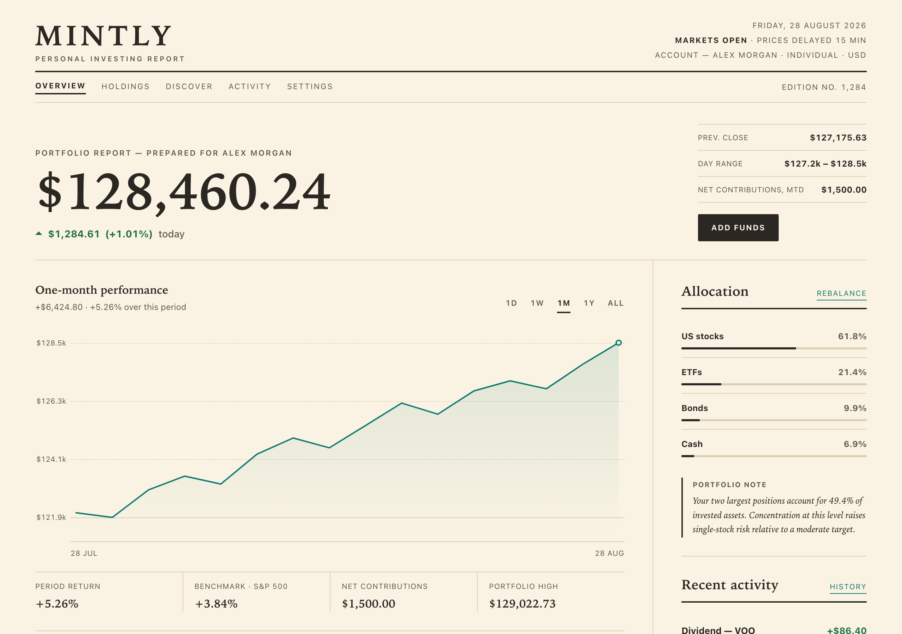
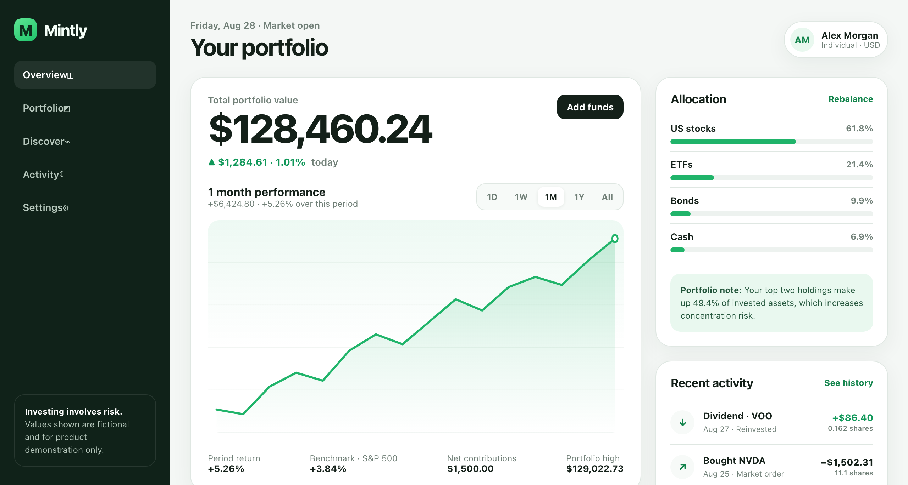

# Examples

These examples use the same brief to compare a typical generated dashboard
against one made with the `humanize-ui` skill.

**With `humanize-ui`**


**Without `humanize-ui`**


## Prompt Without `humanize-ui`

```text
Create a responsive investment dashboard for a fictional retail investing
app called Mintly.

Requirements:
- Output a single HTML file with CSS inside a <style> tag.
- Include total portfolio value, daily return, a portfolio performance chart,
  key portfolio stats, holdings, and recent activity.
- Include basic controls for switching the chart period.
- Make it responsive for mobile and desktop.
- Treat the dashboard like a real investing product: prioritize important
  financial information, make dense data easy to scan, and provide useful
  context around portfolio performance and holdings.
```

Output file:

- `dashboard-without-humanize-ui.html`

## Prompt With `humanize-ui`

```text
Use the humanize-ui skill.

Create a responsive investment dashboard for a fictional retail investing
app called Mintly.

Requirements:
- Output a single HTML file with CSS inside a <style> tag.
- Include total portfolio value, daily return, a portfolio performance chart,
  key portfolio stats, holdings, and recent activity.
- Include basic controls for switching the chart period.
- Make it responsive for mobile and desktop.
- Treat the dashboard like a real investing product: prioritize important
  financial information, make dense data easy to scan, and provide useful
  context around portfolio performance and holdings.
```

Output file:

- `dashboard-with-humanize-ui.html`
