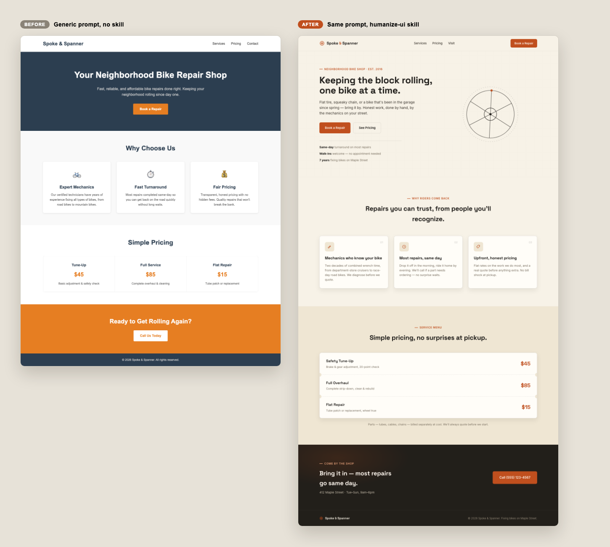

# Examples

These examples use the same brief to compare a typical generated landing
page against one made with the `humanize-ui` skill.



## Prompt Without `humanize-ui`

```text
Create a brief static landing page for a neighborhood bike repair service
called Spoke & Spanner.

Requirements:
- Output a single HTML file with CSS inside a <style> tag.
- Include a hero, 3 service benefits, a simple pricing strip, and a final CTA.
- Make it responsive for mobile and desktop.
- Treat the page like a real local service business: inspect the brief, choose
  a concrete visual direction, use a workshop-specific layout or detail, polish 
  spacing, hierarchy, color, copy, and responsive behavior.
```

Output file:

- `landing-page-without-humanize-ui.html`

## Prompt With `humanize-ui`

```text
Use the humanize-ui skill.

Create a brief static landing page for a neighborhood bike repair service
called Spoke & Spanner.

Requirements:
- Output a single HTML file with CSS inside a <style> tag.
- Include a hero, 3 service benefits, a simple pricing strip, and a final CTA.
- Make it responsive for mobile and desktop.
- Treat the page like a real local service business: inspect the brief, choose
  a concrete visual direction, use a workshop-specific layout or detail, polish 
  spacing, hierarchy, color, copy, and responsive behavior.
```

Output file:

- `landing-page-with-humanize-ui.html`

